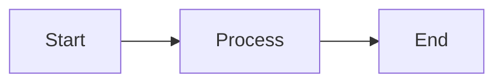

# Khoj Agent Pipelines and Workflows - Complete Analysis

## Overview
Khoj is a multi-pipeline system with specialized agents for different types of user interactions. The core system manages conversation state, controls tool execution, and orchestrates responses through various models.

---

## 1. MAIN CHAT WORKFLOW (Default Conversation Flow)

### Entry Point
- **API Endpoint**: `POST /api/chat` or `WebSocket /api/chat/ws`
- **Function**: `event_generator()` in `api_chat.py:665`
- **Trigger**: User submits a chat query through web/desktop/mobile client

### Sequence of Execution

#### Phase 1: Query Validation & Conversation Setup
1. **Query Validation** (`is_query_empty()`)
   - Check if query is empty or whitespace-only
   - Return error response if empty

2. **Get or Create Conversation**
   - Load existing conversation or create new one
   - Associate with agent (default if none selected)
   - Initialize conversation with agent personality

3. **Extract Conversation Command**
   - Parse `/command` prefixes from query
   - Supported: `/notes`, `/online`, `/research`, `/image`, `/diagram`, `/general`, `/code`, `/operator`
   - Rate limit command usage

#### Phase 2: Data Source & Output Format Selection
- **Function**: `aget_data_sources_and_output_format()` in `helpers.py:347`
- **Prompt Used**: `pick_relevant_tools` (prompts.py:691)
- **Decision Points**:
  ```
  User Query → LLM Analysis → JSON Response:
  {
    "source": ["notes", "online", "code"],  // Data sources to use
    "output": "text"  // Output format (text/image/diagram)
  }
  ```
- **Sources Selected Based On**:
  - User has notes in knowledge base
  - Web search enabled on server
  - Code sandbox enabled
  - Agent input_tools configuration
  - Model capabilities

### Phase 3: Context Gathering

#### 3A. Query Decomposition for Notes Search
- **Function**: `extract_questions()` in `helpers.py:1273`
- **Prompt Used**: `extract_questions_system_prompt` (prompts.py:522)
- **Process**:
  1. Break down user query into 1-5 semantic search queries
  2. Add date filters if temporal context available
  3. Consider chat history for context
  4. Return as JSON: `{"queries": ["search query 1", "search query 2"]}`

#### 3B. Document Search & Retrieval
- **Function**: `search_documents()` in `helpers.py:1166`
- **Process**:
  1. Extract and apply file filters from conversation
  2. Run semantic search using embedding model
  3. Embed queries with sentence transformers
  4. Search across multiple document types (Markdown, PDF, Org, etc.)
  5. Deduplicate and rank results
  6. Return compiled references with source attribution
  
- **Data Flow**:
  ```
  Inferred Queries → Embedding Model → Vector Search → 
  Ranked Results → Formatted References
  {
    "query": "search query",
    "compiled": "extracted text",
    "file": "filename.md",
    "uri": "file://path"
  }
  ```

#### 3C. Online Search
- **Function**: `search_online()` in `online_search.py:69`
- **Prompt Used**: `online_search_conversation_subqueries` (prompts.py:805)
- **Process**:
  1. Generate 1-3 search subqueries from user query
  2. Search using Google Serper API or SearXNG
  3. Extract answer box if available
  4. Optionally read webpages with Firecrawl
  5. Return structured results with URLs
  
- **Data Structure**:
  ```
  {
    "user_query": {
      "answerBox": {...},
      "webpages": [
        {"link": "url", "title": "title", "snippet": "text"}
      ]
    }
  }
  ```

#### 3D. Webpage Reading
- **Function**: `read_webpages()` in `online_search.py`
- **Process**:
  1. Infer 1 webpage URL to read from query
  2. Fetch webpage content with Firecrawl or BeautifulSoup
  3. Convert HTML to markdown
  4. Extract relevant information
  5. Add to online_results under webpages key

#### 3E. Code Execution
- **Function**: `run_code()` in `run_code.py:51`
- **Process**:
  1. Prompt: `python_code_generation_prompt` (prompts.py:878)
  2. Generate Python code based on query and context
  3. Execute in sandboxed environment (E2B or Terrarium)
  4. Capture stdout/stderr output
  5. Return results as dict

#### 3F. Browser Operation (Operator Mode)
- **Function**: `operate_environment()` in `processor/operator/__init__.py:34`
- See Section 9 for detailed operator workflow

### Phase 4: Context Formatting & Message Building
- **Function**: `build_conversation_context()` in `helpers.py:1612`
- **Process**:
  1. Build system prompt with:
     - Agent personality (custom or default)
     - User location
     - User name
     - Current date/day of week
  2. Build context message containing:
     - Formatted notes (YAML)
     - Formatted online results (YAML)
     - Code execution results (truncated)
     - Operator results
  3. Build chat messages with:
     - Previous conversation history (context window limited)
     - System prompt
     - User query + context
     - Query images/files if provided

- **Message Structure**:
  ```
  [
    ChatMessage(role="system", content="system prompt + location + name"),
    ChatMessage(role="user", content="previous question"),
    ChatMessage(role="assistant", content="previous response"),
    ...
    ChatMessage(role="user", content="current query + full context")
  ]
  ```

### Phase 5: LLM Response Generation
- **Function**: `agenerate_chat_response()` in `helpers.py:1711`
- **Process**:
  1. Select appropriate LLM based on model_type:
     - OpenAI: `converse_openai()`
     - Anthropic: `converse_anthropic()`
     - Google: `converse_gemini()`
  2. Send messages to selected LLM
  3. Stream response tokens back to client
  4. Collect usage metrics (tokens, cost)

### Phase 6: Response Streaming & Storage
- **Output Streaming**: Yield tokens as they arrive
- **Status Updates**: Send status messages for each phase
- **Storage**: `save_to_conversation_log()`
  - Save user query
  - Save chat response
  - Store all references (compiled, online, code, operator results)
  - Store generated images/diagrams
  - Store inferred queries
  - Store train of thought (for reasoning models)

### Decision Tree
```
User Query
├─ /research command? → Research Agent (Section 8)
├─ /operator command? → Operator Agent (Section 9)
├─ /automation command? → Schedule Query (Section 10)
├─ Notes available & agent/LLM selected → Determine data sources
│  ├─ Notes source selected? → Extract questions → Search documents
│  ├─ Online source selected? → Generate online subqueries → Web search
│  ├─ Webpage source selected? → Infer webpage URLs → Read webpages
│  ├─ Code source selected? → Generate & execute Python
│  └─ Operator source selected? → Browser operation
├─ Output format == image? → Image generation (Section 5)
├─ Output format == diagram? → Diagram generation (Section 6)
└─ Output format == text? → LLM response generation
   └─ Research results? → Compile and use as context
   └─ Standard context? → Build messages and send to LLM
```

---

## 2. DATA SOURCE SELECTION LOGIC (aget_data_sources_and_output_format)

### Purpose
Intelligently determine which data sources and output format to use based on query and agent configuration.

### Prompt Pipeline
1. **System Prompt**: `pick_relevant_tools.format()`
2. **Input**: User query + available sources + available outputs + chat history
3. **Model Call**: `send_message_to_model_wrapper()` with response_schema=PickTools
4. **Parsing**: JSON extraction and validation

### Available Data Sources (tool_descriptions_for_llm)
- `notes`: Semantic search + document retrieval
- `online`: Web search + answer extraction
- `webpage`: Direct webpage URL reading
- `code`: Python code generation & execution
- `operator`: Browser automation & computer control
- `general`: General knowledge only

### Available Output Formats (mode_descriptions_for_llm)
- `text`: Conversational text response
- `image`: Generated image via DALL-E/Gemini
- `diagram`: Mermaid.js diagram visualization
- `excalidraw`: Excalidraw diagram format

### Decision Factors
```
Source Selection:
- Is user content available? (notes)
- Is web search enabled? (online, webpage)
- Is code sandbox enabled? (code)
- Is operator enabled? (operator)
- Agent input_tools whitelist?

Output Format Selection:
- User explicit request? (e.g., /image)
- Agent output_modes whitelist?
- Query intent (visual/computational/textual)?
```

---

## 3. QUERY GENERATION PIPELINE (extract_questions)

### Purpose
Convert user queries into optimized semantic search queries for document retrieval.

### Entry Point
- Called from `search_documents()` when Notes source is selected
- Function: `extract_questions()` in `helpers.py:1273`

### Prompt Sequence

**System Prompt**: `extract_questions_system_prompt.format()`
```
Instructions:
- Construct up to {max_queries} search queries
- Use diverse perspectives (who, what, where, when, why, how)
- Add date filters for temporal queries
- Use broad topics for vague questions
- Output JSON: {"queries": ["query1", "query2", ...]}
```

**User Message**: `extract_questions_user_message.format()`
```
Chat History:
{previous conversation}

User: {current query}
Assistant: (respond with JSON queries)
```

### Data Transformations
```
User Query
→ Add date context (today, last_year, current_month, etc.)
→ Add location context
→ Add user name context
→ Add agent personality context
→ Construct 1-5 semantic search queries
→ Apply date filters (dt>='date' dt<'date')
→ Return JSON
```

### Examples Provided to LLM
- Generic: "How was my trip to Cambodia?" → ["How was my trip to Cambodia?"]
- Contextual: "Which of them is older?" → ["When was Alice born?", "What is Bob's age?"]
- Date-based: "What did I do for Christmas last year?" → ["What did I do for Christmas {last_year} dt>='{last_year}-12-25' dt<'{last_year}-12-26'"]
- Location-based: "Who all did I meet here yesterday?" → ["Met in {location} on {yesterday_date}"]
- Meta: "How can you help me?" → ["Social relationships", "Physical and mental health", "Education and career"]

### Search Model Details
- Uses sentence-transformers (OpenAI/Anthropic embedding models)
- Vector similarity search on indexed documents
- Multiple document type support (Markdown, PDF, Org, Plaintext, Docx, etc.)
- Deduplication and reranking of results

---

## 4. SEARCH AND RETRIEVAL FLOW

### Document Search Pipeline

**Function**: `execute_search()` in `helpers.py:1356`

#### Step 1: Query Processing
- Remove filter terms (file:, word filters, date filters)
- Encode query with embedding model
- Prepare search tasks

#### Step 2: Content Type Routing
```
Search Type Decision:
├─ If All/Org/Markdown/etc. → text_search.query()
├─ Multi-threaded parallel search
└─ Gather results from all types
```

#### Step 3: Result Processing
1. Collate results across content types
2. Rerank and sort by relevance
3. Deduplicate if requested
4. Take top N results (default 7)
5. Cache results per user/query combo

#### Step 4: Result Formatting
```
SearchResponse → Formatted Reference
{
  "query": inferred_query,
  "compiled": extracted_text,
  "file": filename,
  "uri": file_uri
}
```

### Caching Strategy
- **Cache Key**: `{user_query}-{n}-{search_type}-{rank}-{max_distance}-{dedupe}`
- **Storage**: `state.query_cache[user.uuid]`
- **Scope**: Per-user query caching

---

## 5. IMAGE GENERATION PIPELINE

### Entry Point
- **Trigger**: Output format selected as "image" OR `/image` command
- **Function**: `text_to_image()` in `processor/image/generate.py:39`

### Prompt Sequence

#### Phase 1: Image Prompt Enhancement
- **Function**: `generate_better_image_prompt()` in `helpers.py:1093`
- **Prompt Used**: `enhance_image_system_message` (prompts.py:116)

**System Prompt Instructions**:
```
- You are a media artist describing images
- Retain important information from user instructions
- Weave in context (notes, online results)
- Specify elements, lighting, mood, composition
- Decide image shape: square/portrait/landscape
- Transform negations to positive alternatives
  * "no sun" → "overcast cloudy sky"
  * "don't include people" → "empty landscape"
- Output JSON: {
    "description": "vivid image description",
    "shape": "square|portrait|landscape"
  }
```

**Context Provided**:
- User location
- User documents (notes)
- Online search results
- Agent personality
- Chat history (last 4 messages)

#### Phase 2: Image Generation
- **Provider Selection**:
  - OpenAI DALL-E 3 (primary)
  - Google Gemini 2.0 Flash (alternative)
- **Parameters**:
  - Model: `dall-e-3` or `gemini-2.0-flash`
  - Size: 1024x1024 (square), 1792x1024 (landscape), 1024x1792 (portrait)
  - Quality: "hd" (if available)

#### Phase 3: Image Storage & Return
- Convert to WebP format
- Upload to cloud storage (optional)
- Return as base64 data URL or cloud URL

### Data Flow
```
User Request
→ Extract recent chat context
→ Format image prompt with context
→ Send to image LLM
→ Parse JSON response (description + shape)
→ Generate image via API
→ Convert to WebP
→ Store in cloud bucket
→ Return URL to client
```

---

## 6. DIAGRAM GENERATION WORKFLOW

### Two Diagram Engines
1. **Mermaid.js** (Primary): Flowcharts, sequence diagrams, state diagrams, Gantt charts
2. **Excalidraw** (Alternative): Hand-drawn style diagrams

### Mermaid.js Pipeline

**Entry Point**: `generate_mermaidjs_diagram()` in `helpers.py:954`

#### Phase 1: Diagram Prompt Enhancement
- **Function**: `generate_better_mermaidjs_diagram_description()`
- **Prompt Used**: `improve_mermaid_js_diagram_description_prompt` (prompts.py:311)

**System Prompt**:
```
- You are a senior architect translating requests to detailed descriptions
- Available diagram types: Flowchart, Sequence, Gantt, State, Pie
- Describe layout, components, connections
- Use simple, concise language
- Consider user notes, online results, chat history
```

#### Phase 2: Mermaid Syntax Generation
- **Function**: `generate_mermaidjs_diagram_from_description()`
- **Prompt Used**: `mermaid_js_diagram_generation_prompt` (prompts.py:348)

**Output Requirements**:
```
- Valid Mermaid.js syntax
- Max 15 nodes per diagram
- All node labels in double quotes
- format: id["label"]
- No custom styles
- No title field for flowcharts/sequence/state
- Just provide diagram, no extra text
```

**Example Output**:


#### Phase 3: Rendering
- Validate Mermaid syntax
- Return to client as string
- Client-side rendering via mermaid.js library

### Excalidraw Pipeline

**Function**: `generate_excalidraw_diagram()` in `helpers.py:792`

#### Phase 1: Diagram Description
- Similar to Mermaid, generate enhanced description
- **Prompt Used**: `improve_excalidraw_diagram_description_prompt` (prompts.py:167)

#### Phase 2: Element Generation
- **Prompt Used**: `excalidraw_diagram_generation_prompt` (prompts.py:205)
- **Primitives**: Text, Rectangle, Ellipse, Line, Arrow

**Output Schema**:
```json
{
  "scratchpad": "thought process",
  "elements": [
    {
      "type": "rectangle",
      "id": "unique_id",
      "x": 0, "y": 0, "width": 100, "height": 50,
      "strokeColor": "black",
      "backgroundColor": "white",
      "label": { "text": "My Box" }
    },
    {
      "type": "arrow",
      "id": "arrow_1",
      "points": [[0, 0], [100, 100]],
      "start": { "id": "element_1" },
      "end": { "id": "element_2" }
    }
  ]
}
```

#### Phase 3: Rendering
- Parse JSON elements
- Render in Excalidraw canvas on client
- Allow user editing

### Failure Handling
- If generation fails, provide ASCII art fallback
- Prompt: `failed_diagram_generation`

---

## 7. CODE EXECUTION PIPELINE

### Entry Point
- **Trigger**: Code source selected by data source selector
- **Function**: `run_code()` in `processor/tools/run_code.py:51`

### Execution Phases

#### Phase 1: Code Generation
- **Function**: `generate_python_code()`
- **Prompt Used**: `python_code_generation_prompt` (prompts.py:878)

**System Instructions**:
```
- Construct secure Python program for query
- Sandbox has: matplotlib, pandas, numpy, scipy, sympy, etc.
- No tkinter, torch, tensorflow, catboost, requests
- Write outputs to files, not display directly
- Use context from conversation
- Self-contained program (no access to current scope)
```

**Context Provided**:
- Current date
- User location
- User name
- Previous notes + online results
- Chat history
- Code execution results from prior runs

**Output**: Python code in markdown code block

#### Phase 2: Code Execution
- **Sandboxes Available**:
  - E2B Code Sandbox (primary)
  - Terrarium Sandbox (fallback)

**Process**:
1. Extract code from markdown
2. Load any referenced user files
3. Encode files to base64
4. Send code + files to sandbox
5. Execute with timeout (typically 30-60s)
6. Capture stdout/stderr

#### Phase 3: Result Processing
- Parse execution output
- Format results (tables, plots, etc.)
- Include in context for final response

### Example Code Generation
```python
# Query: "Plot world population growth"
import pandas as pd
import matplotlib.pyplot as plt

data = {
    'Year': [2000, 2010, 2020],
    'Population': [6.1, 6.9, 7.8]
}
df = pd.DataFrame(data)

plt.figure(figsize=(10, 6))
plt.plot(df['Year'], df['Population'], marker='o')
plt.title('World Population Growth')
plt.xlabel('Year')
plt.ylabel('Population (Billions)')
plt.savefig('population_plot.png')
```

### File Access
- Users can reference files in code: `open('/path/to/file')`
- Sandbox provides read-only access to indexed user files
- Outputs written to `/tmp` or designated output directory

---

## 8. RESEARCH/PLANNING AGENT WORKFLOW

### Entry Point
- **Trigger**: `/research` command OR Research selected as source
- **Function**: `research()` in `routers/research.py:220`

### Multi-Iteration Planning Loop

#### Phase 1: Tool Selection
- **Function**: `apick_next_tool()` in `routers/research.py:50`
- **Prompt Used**: `plan_function_execution` (prompts.py:644)

**System Prompt**:
```
- You are Khoj, smart creative researcher
- Create multi-step plan and iterate intelligently
- Make detailed, self-contained requests to tool AIs
- Break research into independent, sequential steps
- Max {max_iterations} iterations
- Available tools: [list of tools]
```

**Tool Selection Prompt**:
```
Which tool will you use to research:
1. Semantic search on notes
2. Regex search on notes
3. View file content
4. List files
5. Search web
6. Read webpage
7. Execute Python code
8. Operate browser
9. Generate final response (text)

Respond with JSON tool call:
{
  "name": "semantic_search_files|regex_search_files|...",
  "args": {...}
}
```

#### Phase 2: Research Iteration Loop
```
For iteration in range(max_iterations):
  1. Get current environment state (screenshots, file system, etc.)
  2. LLM decides next action(s)
  3. Execute tool(s) with provided arguments
  4. Collect results
  5. Update state
  6. Check termination conditions
  7. If more research needed, loop
  8. If research complete, generate summary
```

#### Phase 3: Tool-Specific Workflows

##### 3A. Semantic Search in Research Context
- **Args**: `{"query": "search query"}`
- **Process**: Same as document search (Section 4)
- **Difference**: Results cached per research iteration to avoid repeats

##### 3B. Regex Search Files
- **Args**: `{"pattern": "regex pattern"}`
- **Function**: `grep_files()` in `helpers.py`
- **Returns**: Matching file contents

##### 3C. View File Content
- **Args**: `{"path": "file_path", "start_line": int, "end_line": int}`
- **Function**: `view_file_content()` in `helpers.py`
- **Returns**: File excerpt

##### 3D. List Files
- **Args**: `{"path": "directory_path"}`
- **Function**: `list_files()` in `helpers.py`
- **Returns**: Directory listing

##### 3E. Web Research Tools
- **Search Web**: Same as Section 4 (online search)
- **Read Webpage**: Same as Section 4 (webpage reading)

##### 3F. Code Execution in Research
- **Tool**: `python_coder`
- **Process**: Same as Section 7 (code execution)
- **Context**: Includes previous iteration results

##### 3G. Browser Operation in Research
- **Tool**: `operate_computer`
- **Process**: Similar to Section 9 (operator workflow)

#### Phase 4: Research Summarization
**When research completes**:
1. Compile results from all iterations
2. Extract key findings
3. Format as research summary
4. Provide to main chat for final response generation

### Research Results Structure
```python
ResearchIteration {
  query: ToolCall,              # Which tool was used
  context: [references],         # Document results
  onlineContext: {urls: results}, # Web search results
  codeContext: {code: output},   # Code execution output
  operatorContext: OperatorRun,  # Browser results
  summarizedResult: str,         # Summarization of findings
  warning: str                   # If iteration failed
}
```

### Cancellation & Interruption
- **Cancellation Event**: Set when user disconnects
- **Interrupt Queue**: User can send new instructions mid-research
- **Behavior**: Stop current iteration, append new instruction to history, restart research

---

## 9. OPERATOR AGENT WORKFLOW (Browser/Computer Automation)

### Entry Point
- **Trigger**: `/operator` command OR Operator selected as source
- **Function**: `operate_environment()` in `processor/operator/__init__.py:34`

### Core Components

#### 1. Environment Selection
```
EnvironmentType:
├─ COMPUTER (desktop environment)
└─ BROWSER (web browser automation)
```

#### 2. Model Selection
- **Anthropic** (Primary): Better vision understanding
- **OpenAI** (Experimental): Alternative
- **Binary Operator** (Future): UI grounding model

#### 3. Vision-Enabled Model
- Must have `vision_enabled=True`
- Fallback to vision-enabled model if primary doesn't support vision
- Used for screenshot analysis and action planning

### Operator Loop

#### Phase 1: Environment Initialization
```
Initialize Operator Agent:
- Create chat model with vision capabilities
- Set max context size
- Load conversation history
- Prepare previous trajectory (if continuing task)

Initialize Environment:
- Browser: Selenium/Playwright-based
- Computer: Docker-based desktop environment
- Screenshot resolution: 1024x768
```

#### Phase 2: Main Control Loop
```
For iteration in range(max_iterations):
  1. Get Current State
     → Take screenshot
     → OCR text recognition
     → Extract DOM elements (browser)
     → Return: EnvState {height, width, screenshot_base64, url}
  
  2. Agent Decision-Making
     → Encode screenshot as base64 image
     → Send to vision LLM with chat history
     → LLM analyzes state and decides actions
     → Parse actions from response
  
  3. Execute Actions
     → For each action in planned actions:
        ├─ Type text in input field
        ├─ Click on element
        ├─ Scroll page
        ├─ Navigate to URL
        ├─ Extract text from element
        └─ Request user input (pause execution)
     → Capture environment response
  
  4. Status Update
     → Send rendered action to client
     → Include screenshot of result
  
  5. Termination Check
     ├─ No actions returned? → Task complete
     ├─ Max iterations reached? → Stop
     ├─ User input requested? → Pause
     └─ User cancellation? → Stop
```

#### Phase 3: Agent Actions

**OperatorAction Types**:
```
type Action = 
  | Type { element_id: str, text: str }
  | Click { element_id: str }
  | Scroll { direction: "up" | "down", amount: int }
  | Navigate { url: str }
  | Extract { element_id: str }
  | Wait { seconds: float }
  | Request User Input { request: str }
```

**Action Parsing from LLM**:
- LLM returns action plan in structured format
- Parse action names and parameters
- Map to OperatorAction objects
- Execute in sequence

#### Phase 4: Result Summarization
- Extract final page content
- Summarize completed actions
- Return response to user
- Store in OperatorRun result

### Data Structure
```python
OperatorRun {
  query: str,                    # Original user query
  trajectory: [AgentMessages],   # All LLM interactions
  response: str,                 # Final summary
  webpages: [{url, title}]       # Pages visited
}
```

### Interruption Handling
- **Interrupt Queue**: Monitor for user messages during operation
- **Behavior**: 
  - If INTERRUPT: Stop gracefully
  - If message: Append to chat history, continue with new instruction
- **Graceful Stop**: Complete current iteration, save state

### Limitations & Safety
- Max iterations: 100 (configurable via `KHOJ_OPERATOR_ITERATIONS`)
- Timeout per action: ~30 seconds
- Cannot access sensitive data outside sandbox
- All interactions logged for user review

---

## 10. AUTOMATION/SCHEDULED TASKS PIPELINE

### Entry Point
- **Trigger**: `/automated_task` command OR automation creation endpoint
- **Functions**: 
  - Create: `post_automation()` in `api_automation.py:51`
  - Schedule: `schedule_automation()` in `helpers.py:2445`
  - Execute: `scheduled_chat()` (triggered by APScheduler)

### Automation Creation Flow

#### Phase 1: Query Inference
- **Function**: `schedule_query()` in `helpers.py:595`
- **Prompt Used**: `crontime_prompt` (prompts.py:1033)

**LLM Instructions**:
```
Given user query, infer:
1. Cron time string (Unix cron format or human description)
2. Optimized query to run
3. Email subject line for notification

Return JSON:
{
  "crontime": "0 9 * * *",    // 9 AM daily
  "query": "/research ...",   // Optimized query
  "subject": "Daily Report"   // Email subject
}
```

**Example Mappings**:
- "Every morning" → `0 9 * * *` (9 AM daily)
- "Monday evening at 6" → `0 18 * * 1` (6 PM Mondays)
- "First Sunday of month" → `0 8 1-7 * 0` (8 AM first Sunday)

#### Phase 2: Validation & Scheduling
```
Validation:
- Is crontime valid? (Use cron_descriptor.get_description())
- No minute-level recurrence? (Load balancing)
  └─ If "*" in minutes, randomize: floor(random() * 60)
- Parse timezone (pytz)

Scheduling:
- Create APScheduler CronTrigger
- Add jitter: 60 seconds (randomize execution)
- Create conversation for task results
- Register automation in database
```

#### Phase 3: Job Metadata
```json
Job ID: "automation_{user.uuid}_{query_md5}"
Metadata: {
  "query_to_run": "/automated_task /research ...",
  "scheduling_request": "Show new posts every morning",
  "subject": "Daily Hacker News Posts",
  "crontime": "0 9 * * *",
  "conversation_id": "conv_uuid"
}
```

### Automation Execution Flow

#### Phase 1: Job Trigger
- APScheduler fires job at scheduled time
- Acquire process lock to prevent duplicate execution
- Load automation metadata

#### Phase 2: Chat Execution
- **Function**: `scheduled_chat()`
- **Process**:
  1. Execute query using same chat pipeline (Section 1)
  2. No user interaction (fully automated)
  3. Capture full response and all references

#### Phase 3: Notification Decision
- **Function**: `to_notify_or_not()` prompt in `prompts.py:1214`

**Decision Prompt**:
```
Original User Query: "Email me new Calvin and Hobbes quotes daily"
Executed Query: "Find funny Calvin and Hobbes quotes"
AI Response: "Here is a quote: '...'"

Should user be notified?
- Only if response satisfies original requirements
- If conditions not met (e.g., no rain forecast), skip email

Return JSON:
{
  "reason": "Quote found matches requirements",
  "decision": "Yes" | "No"
}
```

#### Phase 4: Result Formatting & Notification
- **Function**: `automation_format_prompt` in `prompts.py:1255`

**Format Prompt**:
```
Convert AI response to clear markdown report:
- Add section headings
- Format as email body
- No disclaimers
- Remember: Can reference user's notes forever
- Include summary if complex results

Return: Markdown formatted content
```

#### Phase 5: Email Delivery
- **Email Service**: Resend.com or custom SMTP
- **Content**: Formatted markdown as email body
- **Subject**: Automation subject from metadata

### Automation Management

**Operations**:
1. **Get Automations**: List all active automations
2. **Update Automation**: Modify crontime or query
3. **Delete Automation**: Remove scheduled job
4. **Manual Trigger**: Run automation immediately (in thread)

### Storage
- **Database**: Automation model stores:
  - User
  - Query to run
  - Crontime string
  - Conversation ID
  - Metadata (subject, original request)
- **Scheduler**: APScheduler JobStore

---

## 11. PROMPT SEQUENCE SUMMARY TABLE

| Pipeline | Prompt 1 | Prompt 2 | Prompt 3 | Prompt 4 |
|----------|----------|----------|----------|----------|
| **Chat Workflow** | `pick_relevant_tools` | `extract_questions_system` | Context formatted | Model-specific |
| **Image Gen** | `enhance_image_system_message` | (Image API) | N/A | N/A |
| **Diagram (Mermaid)** | `improve_mermaid_js_diagram` | `mermaid_js_diagram_generation` | (Render) | N/A |
| **Diagram (Excalidraw)** | `improve_excalidraw_diagram` | `excalidraw_diagram_generation` | (Render) | N/A |
| **Code Execution** | `python_code_generation_prompt` | (Code Sandbox) | N/A | N/A |
| **Research** | `plan_function_execution` | Tool-specific prompts | Results compilation | Final response |
| **Operator** | Vision-LLM decision-making | Per-iteration analysis | Action execution | Final summary |
| **Automation** | `crontime_prompt` | Same as chat workflow | `to_notify_or_not` | `automation_format_prompt` |

---

## 12. DATA FLOW DIAGRAM

```
User Query Entry
│
├─ Query Validation
│
├─ Conversation Management
│  └─ Load/Create Conversation
│
├─ Command Extraction
│  ├─ /research → Research Agent
│  ├─ /operator → Operator Agent
│  ├─ /automation → Automation Workflow
│  └─ default → Data Source Selector
│
├─ Data Source Selection (aget_data_sources_and_output_format)
│  ├─ Uses: pick_relevant_tools prompt
│  ├─ Decides: [notes, online, code, operator] + [text|image|diagram]
│  └─ Routes to appropriate pipelines
│
├─ Context Gathering (Parallel)
│  ├─ Notes → extract_questions → search_documents → references
│  ├─ Online → generate_online_subqueries → search_online → results
│  ├─ Webpage → infer_webpage_urls → read_webpages → content
│  ├─ Code → generate_python_code → execute_sandboxed → output
│  └─ Operator → operate_environment → actions → results
│
├─ Output Generation
│  ├─ Text → build_conversation_context → LLM → response
│  ├─ Image → generate_better_image_prompt → Image API → URL
│  └─ Diagram → improve_prompt → diagram_generation_prompt → syntax
│
└─ Response & Storage
   ├─ Stream to client
   ├─ Save to conversation_log
   │  ├─ Query
   │  ├─ Response
   │  ├─ All references
   │  ├─ Generated assets
   │  └─ Metadata
   └─ Update user interface
```

---

## 13. CONTEXT WINDOW MANAGEMENT

### Token Counting
```python
max_prompt_size = await ConversationAdapters.aget_max_context_size(chat_model, user)
# OpenAI GPT-4: 60,000-120,000 tokens
# Anthropic Claude: 60,000-200,000 tokens
# Google Gemini: 60,000-120,000 tokens
```

### Context Assembly Strategy
1. **Reserve Space**:
   - System prompt: ~200-500 tokens
   - User query: ~50-2000 tokens
   - References: ~20-40% of total
   - Chat history: ~30-50% of total

2. **Priority Order** (when truncating):
   - System prompt (always included)
   - Current query + context (always included)
   - Recent chat history (included first)
   - Older messages (truncated as needed)
   - References (truncated last)

3. **Tokenization**:
   - Model-specific tokenizer
   - Split chat history by message
   - Truncate references intelligently
   - Respect token limits before API call

---

## 14. ERROR HANDLING & FALLBACKS

### Chat Workflow Fallbacks
```
1. Data source selection fails
   → Fallback to [General] source
   
2. Notes search fails
   → Skip notes, continue with other sources
   
3. Online search fails
   → Skip online, continue with other sources
   
4. Image generation fails
   → Show ASCII art or placeholder
   
5. Code execution fails
   → Return error message to user
   
6. LLM API fails
   → Return error, save partial state
   
7. User disconnects
   → Save partial state to conversation_log
   → Allow resumption on reconnect
```

### Research Workflow Fallbacks
```
1. Tool selection LLM fails
   → Return warning, skip iteration
   
2. Tool execution fails
   → Log error, continue to next iteration
   
3. Max iterations reached
   → Compile partial results and return
   
4. Repeated tool+query combo detected
   → Skip and try different tool
```

### Operator Fallbacks
```
1. Vision model unavailable
   → Error - cannot proceed without vision
   
2. Screenshot capture fails
   → Retry up to 3 times
   
3. Action execution fails
   → Log error, continue with next action
   
4. Environment crashes
   → Reinitialize and resume
```

---

## 15. PERFORMANCE OPTIMIZATIONS

### Caching
1. **Query Cache**: Per-user search result caching
2. **Embedding Cache**: Cached embeddings for repeated queries
3. **Token Cache**: Model-specific token counts

### Parallelization
1. **Search Phase**: Multiple document types searched in parallel
2. **Tool Phase**: Multiple tools can execute in research mode
3. **Streaming**: Response tokens streamed as generated

### Rate Limiting
1. **API Rate Limits**: Per-minute and per-day limits
2. **Command Limits**: `/research` command daily limit
3. **Automation Rate Limits**: Min 1 minute between executions

### Timeout Management
- Document search: ~10-30 seconds
- Online search: ~10-30 seconds
- Webpage reading: ~30-60 seconds
- Code execution: ~30-60 seconds
- Image generation: ~30-60 seconds
- LLM response: varies (streaming)

---

## Summary

Khoj's architecture uses a modular, multi-agent approach where:

1. **Central Chat Router** (`api_chat.py`) orchestrates all workflows
2. **Data Source Selector** uses LLM intelligence to decide which tools to use
3. **Parallel Processing** of multiple data sources for efficiency
4. **Flexible Output Formats** (text, image, diagram) based on intent
5. **Research Agent** for complex multi-step information gathering
6. **Operator Agent** for browser/desktop automation
7. **Automation System** for scheduled task execution
8. **Smart Context Management** to maximize useful information in fixed token windows

Each pipeline uses carefully crafted prompts to extract maximum value from models while maintaining safety and user control through interruption and cancellation mechanisms.

